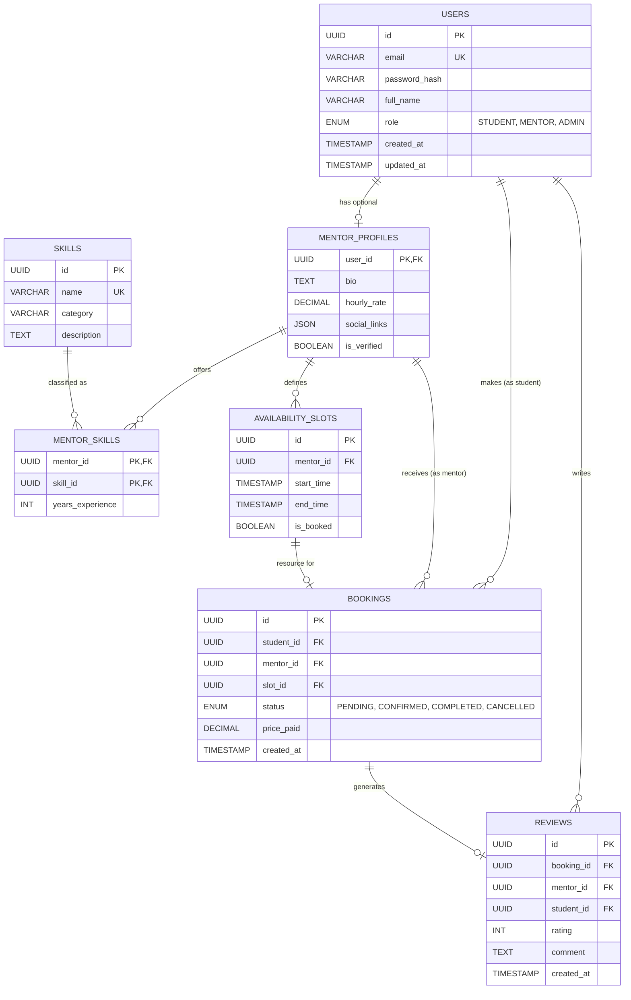

# 🗂️ Entity Relationship Diagram (ERD) - Learnova

This document defines the database schema structure, focusing on data integrity, relationships, and scalability.

## Key Schema Decisions
1.  **Normalization**: The schema is normalized to 3NF to reduce redundancy (e.g., `SKILLS` are separate from `MENTOR_PROFILES`).
2.  **Foreign Keys**: Strict referential integrity on all relationships (e.g., `BOOKINGS` relies on valid `USERS` and `SLOTS`).
3.  **Scalability**: UUIDs are used for Primary Keys instead of auto-incrementing integers to allow for distributed database scaling and security.
4.  **Flexibility**: `MENTOR_SKILLS` is a junction table allowing Many-to-Many relationships between Mentors and Skills.
