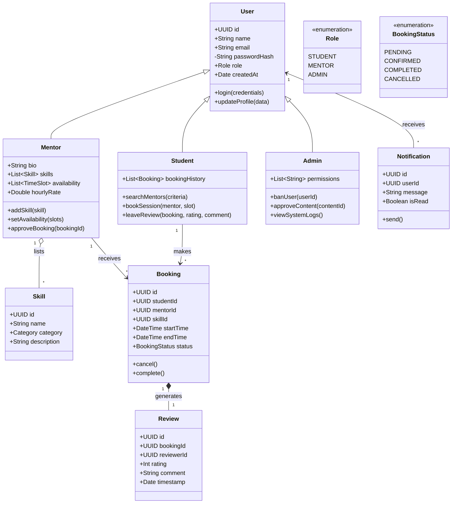

# 🏗️ Class Diagram - Learnova

This diagram represents the Object-Oriented structure of the backend, following Clean Architecture principles. It highlights encapsulation, inheritance, and polymorphism.

## Design Principles Applied
*   **Inheritance**: `Student`, `Mentor`, and `Admin` all inherit common properties (id, email, etc.) from the abstract `User` class.
*   **Encapsulation**: Private attributes like `passwordHash` are managed internally.
*   **Abstraction**: High-level actions like `bookSession` abstract away the complexity of database transactions and availability checks.
