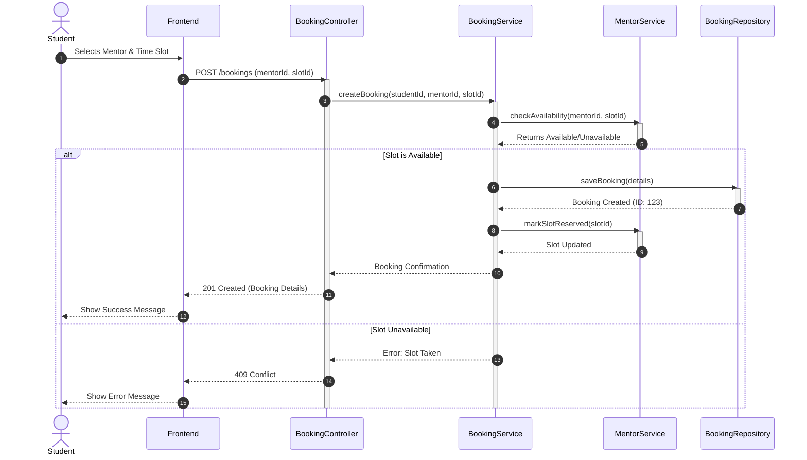
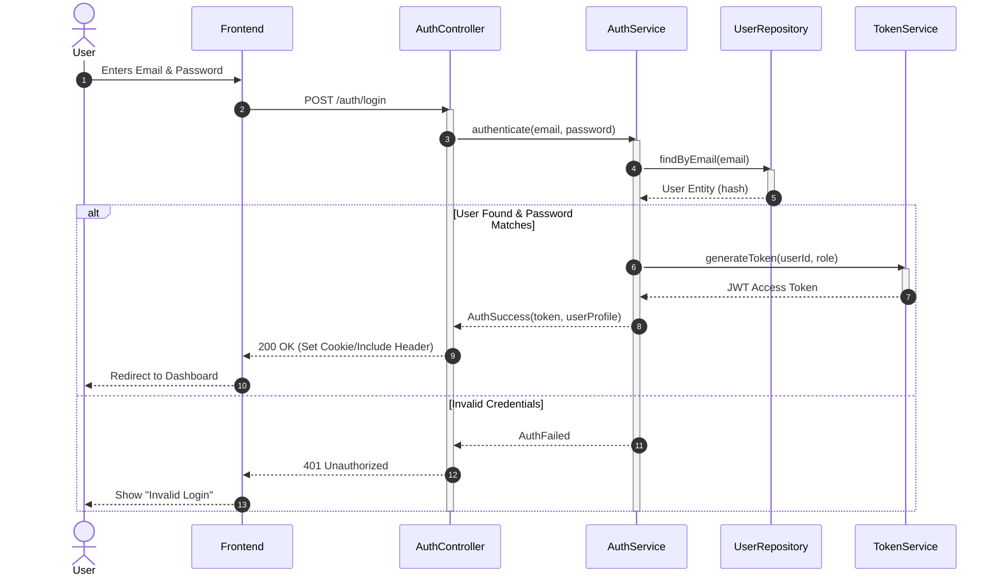
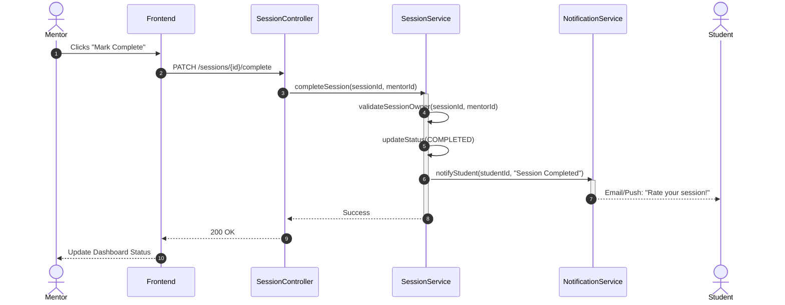

# 🔄 Sequence Diagrams - Learnova

This document details critical workflows within the Learnova system using sequence diagrams.

## 1. End-to-End Booking Flow

This flow illustrates how a Student finds a mentor and successfully books a session.

## 2. Authentication Flow (JWT)

This flow shows how a user logs in and receives a secure token.

## 3. Session Completion Flow

This flow depicts a Mentor marking a session as complete, allowing the Student to leave a review.

