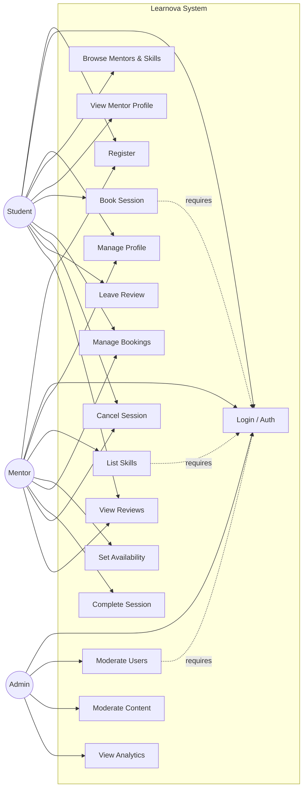

# Use Case Diagram - Learnova

This document outlines the interactions between the primary actors (Student, Mentor, Admin) and the Learnova system, utilizing a GitHub-compatible flowchart to represent use cases.

## Actors & Key Responsibilities

### Student
The core consumer of the platform seeking knowledge.
*   **Key Responsibilities**:
    *   Register and maintain a personal profile.
    *   Search for mentors based on skills and ratings.
    *   Book and pay for learning sessions.
    *   Attend sessions and provide reviews/ratings.

### Mentor
The expert provider sharing knowledge.
*   **Key Responsibilities**:
    *   Create a professional profile highlighting expertise.
    *   List specific skills and set hourly rates.
    *   Manage calendar availability for sessions.
    *   Conduct sessions and track earnings.
    *   *Note: A user can act as both a Student and a Mentor.*

### Admin
The system overseer ensuring quality and safety.
*   **Key Responsibilities**:
    *   Monitor platform health and analytics.
    *   Moderate user accounts (ban/suspend violators).
    *   Review and approve content or skill listings.
    *   Resolve disputes between Students and Mentors.
