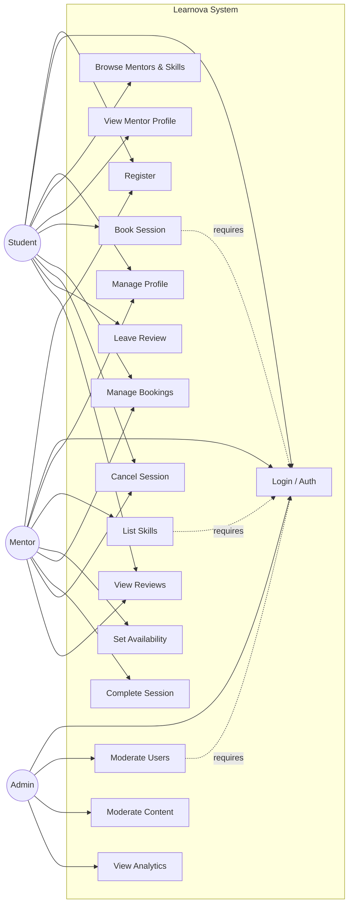

# Use Case Diagram - Learnova

This document outlines the interactions between the primary actors (Student, Mentor, Admin) and the Learnova system, utilizing a GitHub-compatible flowchart to represent use cases.

## Description of Actors
1.  **Student**: A user seeking to learn new skills. Can browse, book, and review mentors.
2.  **Mentor**: A user offering expertise. Can list skills, set availability, and conduct sessions.
    *   *Note: A user can potentially hold both roles, but interactions are distinct.*
3.  **Admin**: System administrator responsible for platform health, moderation, and user management.
